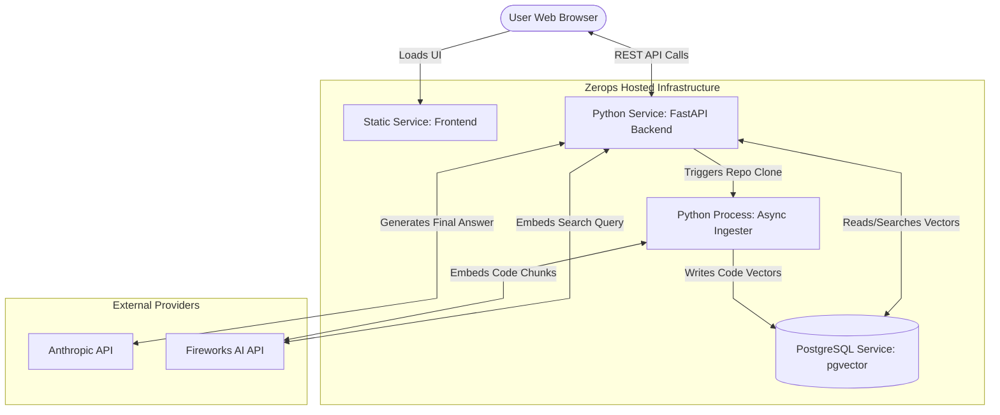

# Repo Onboarding Assistant

## Overview
Repo Onboarding Assistant is a Retrieval-Augmented Generation (RAG) based application designed to accelerate developer onboarding for new codebases. By providing a GitHub URL, the application clones the repository, processes the source code, generates vector embeddings, and allows users to query the codebase using natural language. 

This project was built specifically for the Zerops Hackathon, demonstrating how complex AI/ML pipelines, backend services, and vector databases can be seamlessly orchestrated and deployed using the Zerops developer platform.

## Architecture
The application consists of three primary components, all natively orchestrated on Zerops:

1. **Frontend (Static Service)**: A clean, static HTML/JS/CSS web interface that serves as the user portal.
2. **Backend API & Ingester (Python Service)**: A FastAPI application responsible for handling user queries, alongside an asynchronous ingestion engine that clones repositories, chunks code, and generates embeddings.
3. **Vector Database (PostgreSQL Service)**: A PostgreSQL database utilizing the `pgvector` extension to store and query code embeddings efficiently.



**External Integrations:**
* **Fireworks AI**: Generates embeddings using the `nomic-ai/nomic-embed-text-v1.5` model (768 dimensions).
* **Anthropic**: Serves as the primary LLM for synthesizing retrieved context and generating answers.

## Why Zerops?
Deploying a RAG application typically involves managing complex infrastructure (provisioning databases, managing superuser permissions for extensions, handling CI/CD for backend pipelines, and hosting static files). Zerops simplifies this entirely:

* **Unified Configuration**: The entire infrastructure footprint is defined in `zerops.yml`, allowing the database, backend API, and static frontend to be provisioned and configured together.
* **Automated Database Initialization**: The `pgvector` extension requires superuser privileges to install. Zerops securely exposes superuser credentials during the build phase via automatically generated environment variables, allowing the backend to run `db/setup_extension.py` and configure the database autonomously without manual intervention.
* **Seamless Scalability**: The Python API service can scale up automatically to handle intensive embedding workloads.

## Environment Variables
To run this project, the following environment variables are required:

* `FIREWORKS_API_KEY`: Required for generating code embeddings via Fireworks AI.
* `ANTHROPIC_API_KEY`: Required for generating responses using Anthropic Claude.

When deploying on Zerops, these should be added as secret variables in the Zerops Dashboard. Database credentials (`DATABASE_URL`, `DB_SUPERUSER`, etc.) are automatically injected by Zerops.

## Local Development

1. Ensure you have Docker and Docker Compose installed.
2. Start the local PostgreSQL database (pre-configured with `pgvector`):
   ```bash
   docker compose up -d
   ```
3. Initialize the database schema:
   ```bash
   uv run python3 db/client.py
   ```
4. Start the FastAPI server:
   ```bash
   uv run uvicorn api.main:app --reload --port 8000
   ```

## Deployment on Zerops

1. Create a new project in the Zerops Dashboard or use the import feature with the provided `zerops-project.yml`.
2. Add your API keys (`FIREWORKS_API_KEY`, `ANTHROPIC_API_KEY`) as Secret Variables to the `app` service.
3. Trigger the deployment pipeline. Zerops will automatically:
   * Build the frontend and deploy it to the static service.
   * Provision the PostgreSQL database.
   * Run the deployment scripts to install `pgvector` and initialize the schema.
   * Start the FastAPI application.
