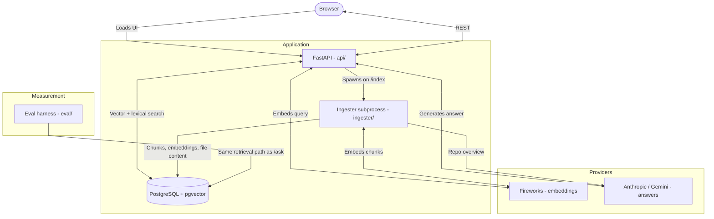

# Repo Onboarding Assistant

Ask questions about an unfamiliar codebase and get answers cited back to exact file and line
ranges.

Point it at a GitHub URL. It clones the repository, chunks and embeds the source and
documentation, and answers natural-language questions against it — every claim linked to the
lines it came from, so you can check the answer rather than trust it.

```
Q: how do I upload and handle files in a form?

Mark the <form> tag with enctype="multipart/form-data"     [docs/patterns/fileuploads.rst:4-5]
Access the uploaded file from the request.files dictionary [docs/quickstart.rst:549]
Secure the filename with werkzeug.utils.secure_filename    [docs/patterns/fileuploads.rst:79-83]
```

*(answered against `pallets/flask`, 514 indexed chunks)*

## Status

Runs **locally**. The Zerops deployment is inactive — see [Deployment](#deployment).

Working: indexing, retrieval, file browsing, cited answers, and a full evaluation harness.
In progress: the retrieval improvements described in [SPEC.md](SPEC.md) — AST-aware chunking,
hybrid search, reranking and query expansion are specified and seamed in, but not yet
implemented, so there is no results table to publish yet.

## Quick start

```bash
docker compose up -d                                # Postgres + pgvector on :5432
uv run python3 db/migrate.py                        # additive; safe to run on live data
uv run python3 preflight.py                         # verify every dependency in one pass
uv run uvicorn api.main:app --reload --port 8000    # http://localhost:8000
```

> **Do not run `db/client.py`.** It drops and recreates both tables. `db/migrate.py` is the
> safe path; `client.py` exists only to bootstrap an empty database.

Run `preflight.py` first whenever something is wrong. It checks Postgres, pgvector, the
schema, the 768-dimension embedding contract and LLM reachability, and tells you which of
those is actually broken instead of failing halfway through an ingest.

### Environment

Put these in `.env`:

| Variable | Required | Purpose |
|---|---|---|
| `FIREWORKS_API_KEY` | **yes** | embeddings — nothing works without it |
| `ANTHROPIC_API_KEY` | one of | answering questions and writing repo overviews |
| `GEMINI_API_KEY` | one of | fallback LLM |
| `ANTHROPIC_WORKSPACE_ID` | conditional | needed only if your Anthropic key is identity-linked |
| `DATABASE_URL` | no | defaults to the local Docker Postgres |
| `LLM_PROVIDER` | no | `auto` (default), `anthropic`, or `gemini` |

## Architecture



Three processes over one database. The ingester is a **detached subprocess**, not a task
queue — `POST /index` spawns it and returns immediately, and the frontend polls
`/overview/{repo_id}` until the status settles.

Chunks and full file content are stored separately: `chunks` is the retrieval index, `files`
holds verbatim content so the file viewer never depends on how the code was chunked.

## How retrieval works

Every retrieval strategy is a **config**, not a branch in the code — and `/ask` and the
evaluation harness call the same entry point, so the system you measure and the system you
ship cannot drift apart.

```
query expansion → dense (pgvector) + lexical (tsvector) → RRF fusion
               → cross-encoder rerank → abstain if weak → line-budget selection → LLM
```

Two details that were measured rather than assumed:

- The full-text index uses Postgres's **`simple`** configuration, never `english`. The
  `english` config strips stopwords, and `is`, `not`, `in`, `and`, `or`, `if` are Python
  keywords — a code question loses most of its terms.
- `simple` splits `send_file` into `send` + `file` for free, but keeps `app.route` as a single
  token. A query built only from the parts would never match the dotted form.

## Evaluation

Retrieval quality is measured, not claimed. The metrics are **pure vector and SQL maths**
against hand-recorded answer locations, so they need no LLM at all and anyone with an
embedding key can reproduce them.

```bash
uv run python3 eval/author.py     # write questions; validates every span against the index
uv run python3 eval/run.py        # score configs; recall, MRR, coverage, paired diffs
```

Two design choices worth naming:

- **Recall at a fixed line budget**, not `recall@k`. Line-based chunks are 100 lines and
  function-level chunks around 20, so a fixed `k` would hand the baseline five times more
  context and bias the comparison toward the thing being measured against.
- **The harness refuses to report a config it cannot actually run.** Scoring an unindexed
  configuration returns nothing and would print `recall=0.000` as though it were a
  measurement. It now says why instead.

## Tests

```bash
uv run python3 -m pytest          # 114 cases
```

Includes cross-checks against a **live Postgres** parser, which caught a real bug: the query
tokenizer split `app.route` into two tokens while Postgres indexes it as one, so a search for
`@app.route` could never have matched.

## Documentation

| File | What it covers |
|---|---|
| [PROJECT.md](PROJECT.md) | Complete reference — data model, every route, constraints, known problems |
| [SPEC.md](SPEC.md) | Plan of record for the retrieval work in progress |
| [CLAUDE.md](CLAUDE.md) | Working guide for AI coding agents |

## Deployment

[zerops.yml](zerops.yml) defines the two-service deployment (Python app + static frontend)
that this project originally ran on. **It is currently inactive** — the account credits
expired — so the project runs locally.

The configuration is kept because it solves a genuinely awkward problem: `pgvector` needs
superuser privileges to install, which the application's own database user does not have.
Zerops exposes superuser credentials as injected environment variables during init, letting
[db/setup_extension.py](db/setup_extension.py) create the extension without manual
intervention. Missing superuser variables is a soft skip, not an error.

When the frontend is served by the static service rather than FastAPI, set `window.API_BASE`
to the API host; [static/app.js](static/app.js) defaults it to same-origin.
